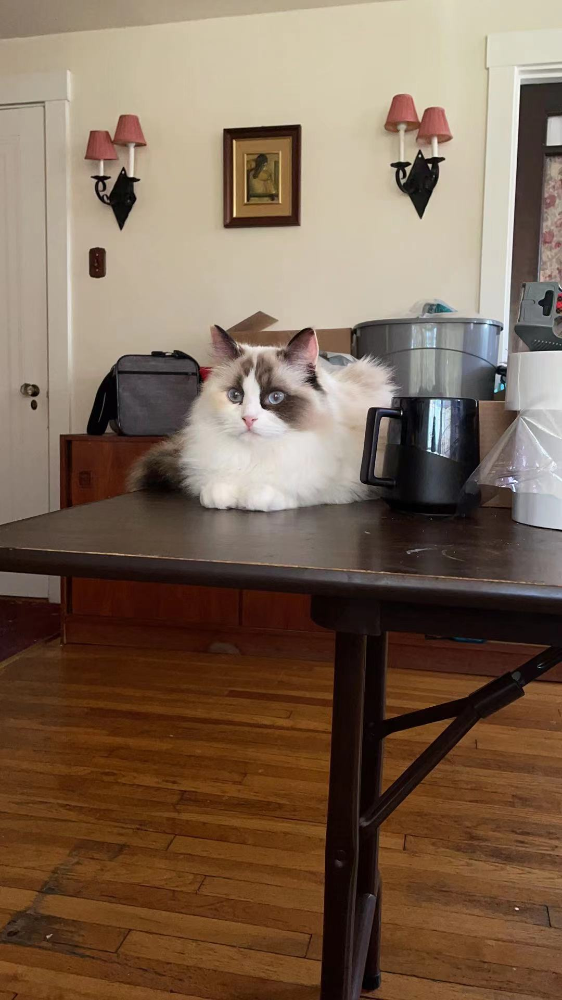

## About
Here we define the cat language with the following syntax:
|Code|Instruction|Description|
| ----- | ----- | ----- |
|0|meow|This command is connected to the mEOW command. When encountered during normal execution, it searches the program code in reverse looking for a matching mEOW command and begins executing again starting from the found mEOW command. When searching, it skips the instruction that is immediately before it (see mEOW).|
|1|meOw|Moves current memory position back one block.|
|2|meoW|Moves current memory position forward one block.|
|3|meOW|Execute value in current memory block as if it were an instruction. The command executed is based on the instruction code value (for example, if the current memory block contains a 2, then the meoW command is executed). An invalid command exits the running program. Value 3 is invalid as it would cause an infinite loop.|
|4|mEow|If current memory block has a 0 in it, read a single ASCII character from STDIN and store it in the current memory block. If the current memory block is not 0, then print the ASCII character that corresponds to the value in the current memory block to STDOUT.|
|5|mEOw|Decrement current memory block value by 1.|
|6|mEoW|Increment current memory block value by 1.|
|7|mEOW|If current memory block value is 0, skip next command and resume execution after the next matching meow command. If current memory block value is not 0, then continue with next command. Note that the fact that it skips the command immediately following it has interesting ramifications for where the matching meow command really is. For example, the following will match the second and not the first meow: Meow mEOW meow meow|
|8|Meow|Set current memory block value to 0.|
|9|MEow|If no current value in register, copy current memory block value. If there is a value in the register, then paste that value into the current memory block and clear the register.|
|10|MeOw|Print value of current memory block to STDOUT as an integer.|
|11|MeoW|Read an integer from STDIN and put it into the current memory block.|

## Example
Try out the [catlang interpreter](https://github.com/hxu296/catlang/blob/main/catlang.cpp) and the hello world program that prints "Hello, world!" to STDOUT:
```bash
g++ -o catlang catlang.cpp
./catlang helloworld.cat
```
The [helloword.cat](https://github.com/hxu296/catlang/blob/main/helloworld.cat) program:
```
mEoW mEoW mEoW mEoW mEoW mEoW mEoW mEoW mEoW mEoW mEoW mEoW mEoW mEoW mEoW mEoW mEoW mEoW mEoW mEoW mEoW mEoW mEoW mEoW mEoW mEoW mEoW mEoW mEoW mEoW mEoW mEoW mEoW mEoW mEoW mEoW mEoW mEoW mEoW mEoW mEoW mEoW mEoW mEoW mEoW mEoW mEoW mEoW mEoW mEoW mEoW mEoW mEoW mEoW mEoW mEoW mEoW mEoW mEoW mEoW mEoW mEoW mEoW mEoW mEoW mEoW mEoW mEoW mEoW mEoW mEoW mEoW mEow mEoW mEoW mEoW mEoW mEoW mEoW mEoW mEoW mEoW mEoW mEoW mEoW mEoW mEoW mEoW mEoW mEoW mEoW mEoW mEoW mEoW mEoW mEoW mEoW mEoW mEoW mEoW mEoW mEoW mEow mEoW mEoW mEoW mEoW mEoW mEoW mEoW mEow mEow mEoW mEoW mEoW mEow Meow mEoW mEoW mEoW mEoW mEoW mEoW mEoW mEoW mEoW mEoW mEoW mEoW mEoW mEoW mEoW mEoW mEoW mEoW mEoW mEoW mEoW mEoW mEoW mEoW mEoW mEoW mEoW mEoW mEoW mEoW mEoW mEoW mEoW mEoW mEoW mEoW mEoW mEoW mEoW mEoW mEoW mEoW mEoW mEoW mEow mEoW mEoW mEoW mEoW mEoW mEoW mEoW mEoW mEoW mEoW mEoW mEoW mEoW mEoW mEoW mEoW mEoW mEoW mEoW mEoW mEoW mEoW mEoW mEoW mEoW mEoW mEoW mEoW mEoW mEoW mEoW mEoW mEoW mEoW mEoW mEoW mEoW mEoW mEoW mEoW mEoW mEoW mEoW mEoW mEoW mEoW mEoW mEoW mEoW mEoW mEoW mEoW mEoW mEoW mEoW mEoW mEoW mEoW mEoW mEoW mEoW mEoW mEoW mEoW mEoW mEoW mEoW mEoW mEoW mEoW mEoW mEoW mEoW mEoW mEoW mEoW mEoW mEoW mEoW mEoW mEoW mEoW mEoW mEoW mEoW mEoW mEoW mEoW mEoW mEoW mEoW mEoW mEoW mEoW mEoW mEoW mEoW mEoW mEoW mEoW mEoW mEoW mEoW mEoW mEoW mEoW mEoW mEoW mEoW mEoW mEoW mEoW mEoW mEoW mEoW mEoW mEow mEOw mEOw mEOw mEOw mEOw mEOw mEOw mEOw mEOw mEOw mEOw mEOw mEOw mEOw mEOw mEOw mEOw mEOw mEOw mEOw mEOw mEOw mEOw mEOw mEOw mEOw mEOw mEOw mEOw mEOw mEOw mEOw mEOw mEOw mEOw mEOw mEOw mEOw mEOw mEOw mEOw mEow mEOw mEOw mEOw mEOw mEOw mEOw mEOw mEOw mEow mEoW mEoW mEoW mEow mEOw mEOw mEOw mEOw mEOw mEOw mEow mEOw mEOw mEOw mEOw mEOw mEOw mEOw mEOw mEow Meow mEoW mEoW mEoW mEoW mEoW mEoW mEoW mEoW mEoW mEoW mEoW mEoW mEoW mEoW mEoW mEoW mEoW mEoW mEoW mEoW mEoW mEoW mEoW mEoW mEoW mEoW mEoW mEoW mEoW mEoW mEoW mEoW mEoW mEow
```

## Acknowledgement
Inspired by *[the COW project](https://bigzaphod.github.io/COW/)* and by our family members momo (first) and miumiu (second):


